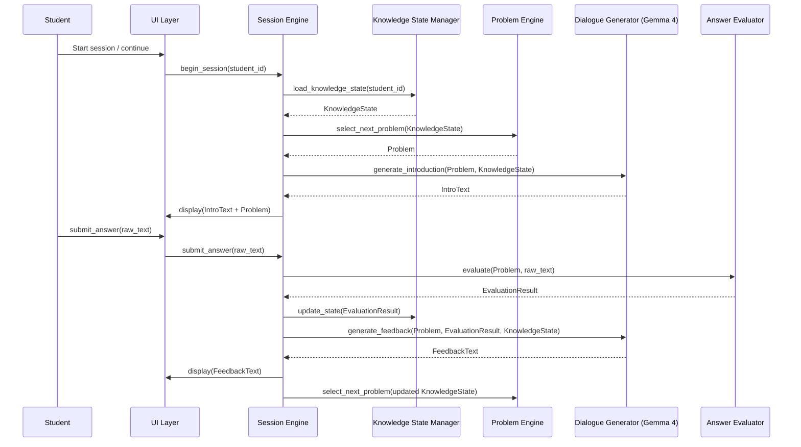
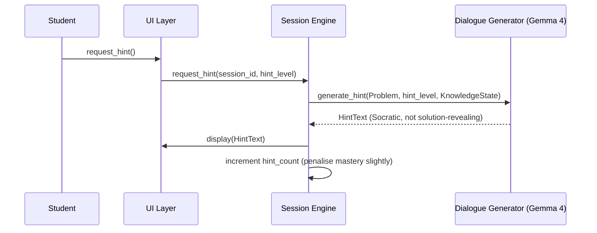

# Design Document: Adaptive Calculus Tutor

## Overview

CalcuLearn is an offline-first adaptive calculus tutoring agent for K-12 students worldwide, powered by Gemma 4 running entirely on-device. The system uses a Knowledge Space Theory (KST) model to map each student's current understanding, then drives a Socratic dialogue loop — asking questions, diagnosing misconceptions, generating targeted explanations and worked examples, and adjusting difficulty in real time. Because the entire inference stack runs locally (Gemma 4 E2B/E4B for edge devices, 26B/31B where hardware permits), students in low-connectivity or no-connectivity environments receive the same quality of personalised instruction as those with broadband access.

The agent covers the standard K-12 calculus curriculum: limits, continuity, derivatives (rules, applications), integrals (definite/indefinite, techniques), and an introduction to differential equations. It supports multiple languages via an on-device translation layer, making it accessible to non-English-speaking students globally.

---

## Architecture

```mermaid
graph TD
    subgraph Student Device (Offline)
        UI[Student UI<br/>Web / Electron / Mobile]
        SE[Session Engine]
        KSM[Knowledge State Manager]
        DG[Dialogue Generator<br/>Gemma 4 E2B/E4B]
        PE[Problem Engine]
        EV[Answer Evaluator]
        TL[Translation Layer]
        DB[(Local SQLite DB<br/>student profile + history)]
    end

    subgraph Optional Sync (Online)
        SYNC[Sync Service]
        CLOUD[(Cloud Analytics DB)]
    end

    UI -->|student input| SE
    SE --> KSM
    SE --> DG
    SE --> PE
    SE --> EV
    DG -->|explanation / hint| TL
    TL -->|localised text| UI
    PE -->|problem + solution| EV
    EV -->|score + diagnosis| KSM
    KSM -->|knowledge state| DB
    DB -->|load state| KSM
    SE -.->|when online| SYNC
    SYNC -.-> CLOUD
```

---

## Sequence Diagrams

### Main Tutoring Loop



### Hint Request Flow



---

## Components and Interfaces

### Component 1: Session Engine

**Purpose**: Orchestrates the tutoring session lifecycle — loading state, sequencing problems, routing inputs, and coordinating all sub-components.

**Interface**:
```typescript
interface SessionEngine {
  beginSession(studentId: string): Promise<Session>
  submitAnswer(sessionId: string, rawAnswer: string): Promise<TurnResult>
  requestHint(sessionId: string): Promise<HintResult>
  endSession(sessionId: string): Promise<SessionSummary>
}
```

**Responsibilities**:
- Maintain session context (current problem, turn count, hint count)
- Route student input to the evaluator
- Trigger knowledge state updates after each turn
- Decide when to advance topic vs. remediate

---

### Component 2: Knowledge State Manager (KSM)

**Purpose**: Maintains a per-student knowledge graph based on Knowledge Space Theory. Each calculus concept is a node; edges encode prerequisite relationships. The KSM tracks mastery probability for each node.

**Interface**:
```typescript
interface KnowledgeStateManager {
  loadState(studentId: string): Promise<KnowledgeState>
  updateState(studentId: string, result: EvaluationResult): Promise<KnowledgeState>
  getNextTargetConcept(state: KnowledgeState): ConceptNode
  getMasteryScore(state: KnowledgeState, conceptId: string): number
  persistState(studentId: string, state: KnowledgeState): Promise<void>
}
```

**Responsibilities**:
- Load/save knowledge state from local SQLite
- Apply Bayesian Knowledge Tracing (BKT) updates after each answer
- Identify the frontier concept (known prerequisites, not yet mastered)
- Detect concept regression and trigger review

---

### Component 3: Problem Engine

**Purpose**: Selects or generates calculus problems appropriate to the student's current knowledge state and target concept.

**Interface**:
```typescript
interface ProblemEngine {
  selectNextProblem(state: KnowledgeState): Promise<Problem>
  generateVariant(template: ProblemTemplate, difficulty: DifficultyLevel): Problem
  getSolutionSteps(problem: Problem): SolutionStep[]
}
```

**Responsibilities**:
- Maintain a curated problem bank (bundled offline)
- Use difficulty ladder: conceptual -> procedural -> application -> proof-sketch
- Generate novel problem variants via Gemma 4 when bank is exhausted
- Provide step-by-step solution for evaluator reference

---

### Component 4: Dialogue Generator (Gemma 4)

**Purpose**: Wraps the on-device Gemma 4 model. Generates all natural-language output: introductions, explanations, hints, feedback, and worked examples.

**Interface**:
```typescript
interface DialogueGenerator {
  generateIntroduction(problem: Problem, state: KnowledgeState): Promise<string>
  generateFeedback(problem: Problem, result: EvaluationResult, state: KnowledgeState): Promise<string>
  generateHint(problem: Problem, hintLevel: number, state: KnowledgeState): Promise<string>
  generateWorkedExample(concept: ConceptNode, state: KnowledgeState): Promise<string>
  generateProblemVariant(template: ProblemTemplate, difficulty: DifficultyLevel): Promise<Problem>
}
```

**Responsibilities**:
- Construct structured prompts with student context, concept metadata, and pedagogical instructions
- Enforce Socratic style: guide, do not give away answers
- Keep responses concise for small-screen devices
- Run inference locally via llama.cpp / Ollama binding

---

### Component 5: Answer Evaluator

**Purpose**: Parses and scores student answers for calculus problems. Handles symbolic math, numeric approximations, and free-text explanations.

**Interface**:
```typescript
interface AnswerEvaluator {
  evaluate(problem: Problem, rawAnswer: string): Promise<EvaluationResult>
  parseSymbolic(raw: string): MathExpression | null
  checkEquivalence(expr1: MathExpression, expr2: MathExpression): boolean
}
```

**Responsibilities**:
- Parse LaTeX-like or plain-text math input
- Use SymPy (Python) or mathjs (JS) for symbolic equivalence checking
- Fall back to Gemma 4 for free-text / conceptual answers
- Return detailed diagnosis: correct, partially correct, specific misconception type

---

### Component 6: Translation Layer

**Purpose**: Translates all Gemma 4 output into the student's preferred language using an on-device lightweight translation model (NLLB-200-distilled-600M).

**Interface**:
```typescript
interface TranslationLayer {
  translate(text: string, targetLanguage: LanguageCode): Promise<string>
  detectLanguage(text: string): Promise<LanguageCode>
  getSupportedLanguages(): LanguageCode[]
}
```

**Responsibilities**:
- Run NLLB-200 locally for 200+ language support
- Cache translations to reduce repeated inference
- Pass math expressions through untranslated (preserve LaTeX)

---

## Data Models

### KnowledgeState

```typescript
interface KnowledgeState {
  studentId: string
  lastUpdated: Date
  concepts: Map<string, ConceptMastery>
  sessionHistory: SessionSummary[]
}

interface ConceptMastery {
  conceptId: string
  masteryProbability: number    // 0.0 - 1.0 (BKT posterior)
  attemptCount: number
  correctCount: number
  lastAttempted: Date | null
  status: 'locked' | 'available' | 'in-progress' | 'mastered'
}
```

**Validation Rules**:
- `masteryProbability` must be in [0.0, 1.0]
- A concept is `available` only if all prerequisite concepts have `masteryProbability >= 0.7`
- A concept is `mastered` when `masteryProbability >= 0.85` sustained over 3+ correct answers

---

### ConceptNode

```typescript
interface ConceptNode {
  id: string                    // e.g. "deriv.chain-rule"
  name: string
  topic: CalculusTopic
  prerequisites: string[]       // conceptIds
  difficulty: 1 | 2 | 3 | 4 | 5
  description: string
  learningObjectives: string[]
}

type CalculusTopic = 'limits' | 'continuity' | 'derivatives' | 'integrals' | 'ode'
```

---

### Problem

```typescript
interface Problem {
  id: string
  conceptId: string
  difficulty: DifficultyLevel
  type: ProblemType
  stem: string                  // LaTeX-formatted problem statement
  answer: MathExpression
  solutionSteps: SolutionStep[]
  commonMisconceptions: Misconception[]
  isGenerated: boolean
}

type DifficultyLevel = 'conceptual' | 'procedural' | 'application' | 'proof-sketch'
type ProblemType = 'multiple-choice' | 'free-response' | 'fill-in' | 'explain-concept'

interface SolutionStep {
  stepNumber: number
  description: string
  expression: string            // LaTeX
  hint: string                  // Socratic hint for this step
}

interface Misconception {
  id: string
  description: string
  incorrectPattern: string
  remediationConceptId: string
}
```

---

### EvaluationResult

```typescript
interface EvaluationResult {
  problemId: string
  isCorrect: boolean
  partialCredit: number         // 0.0 - 1.0
  misconceptions: Misconception[]
  evaluationMethod: 'symbolic' | 'numeric' | 'llm'
  rawAnswer: string
  parsedAnswer: MathExpression | null
  feedbackHints: string[]
}
```

---

### Session

```typescript
interface Session {
  sessionId: string
  studentId: string
  startTime: Date
  turns: TurnRecord[]
  currentProblem: Problem | null
  hintCount: number
  targetConcept: ConceptNode
}

interface TurnRecord {
  turnId: string
  problem: Problem
  rawAnswer: string
  evaluationResult: EvaluationResult
  feedbackShown: string
  hintsUsed: number
  durationMs: number
}
```

---

## Algorithmic Pseudocode

### Main Session Loop

```pascal
ALGORITHM run_tutoring_session(student_id)
INPUT: student_id: String
OUTPUT: SessionSummary

BEGIN
  state <- KSM.load_state(student_id)
  session <- Session.create(student_id, state)

  WHILE session.is_active() DO
    ASSERT all_prerequisites_met(state, session.target_concept)

    problem <- ProblemEngine.select_next_problem(state)
    intro <- DialogueGenerator.generate_introduction(problem, state)
    UI.display(intro, problem)

    turn_complete <- false

    WHILE NOT turn_complete DO
      event <- UI.wait_for_event()

      IF event.type = ANSWER_SUBMITTED THEN
        result <- AnswerEvaluator.evaluate(problem, event.payload)
        state <- KSM.update_state(student_id, result)
        feedback <- DialogueGenerator.generate_feedback(problem, result, state)
        UI.display(feedback)
        session.record_turn(problem, result, feedback)
        turn_complete <- true

      ELSE IF event.type = HINT_REQUESTED THEN
        hint_level <- session.hint_count + 1
        hint <- DialogueGenerator.generate_hint(problem, hint_level, state)
        UI.display(hint)
        session.increment_hint_count()
        KSM.apply_hint_penalty(state, problem.concept_id)

      ELSE IF event.type = SESSION_END THEN
        turn_complete <- true
        session.deactivate()
      END IF
    END WHILE

    IF should_advance_topic(state, session) THEN
      session.target_concept <- KSM.get_next_target_concept(state)
    END IF

  END WHILE

  KSM.persist_state(student_id, state)
  RETURN session.summarise()
END
```

**Preconditions**:
- `student_id` maps to an existing or new student profile
- Local SQLite database is accessible
- Gemma 4 model weights are loaded in memory

**Postconditions**:
- `state` is persisted with updated mastery probabilities
- `SessionSummary` contains all turn records and concept progress delta

**Loop Invariants**:
- `state.concepts` mastery probabilities remain in [0.0, 1.0] throughout
- `session.turns` grows monotonically; no turn is removed mid-session

---

### Bayesian Knowledge Tracing (BKT) Update

```pascal
ALGORITHM bkt_update(mastery_prior, is_correct)
INPUT:
  mastery_prior: Float  -- P(mastered) before this attempt, in [0, 1]
  is_correct: Boolean
OUTPUT:
  mastery_posterior: Float  -- updated P(mastered)

CONSTANTS:
  P_LEARN  <- 0.20   -- P(transitions to mastered | was not mastered)
  P_FORGET <- 0.05   -- P(loses mastery | was mastered)
  P_GUESS  <- 0.20   -- P(correct | not mastered)
  P_SLIP   <- 0.10   -- P(incorrect | mastered)

BEGIN
  IF is_correct THEN
    p_obs <- mastery_prior * (1 - P_SLIP) + (1 - mastery_prior) * P_GUESS
  ELSE
    p_obs <- mastery_prior * P_SLIP + (1 - mastery_prior) * (1 - P_GUESS)
  END IF

  ASSERT p_obs > 0

  IF is_correct THEN
    mastery_posterior_raw <- (mastery_prior * (1 - P_SLIP)) / p_obs
  ELSE
    mastery_posterior_raw <- (mastery_prior * P_SLIP) / p_obs
  END IF

  mastery_posterior <- mastery_posterior_raw + (1 - mastery_posterior_raw) * P_LEARN
  mastery_posterior <- mastery_posterior * (1 - P_FORGET)

  ASSERT mastery_posterior IN [0.0, 1.0]
  RETURN mastery_posterior
END
```

**Preconditions**:
- `mastery_prior` in [0.0, 1.0]
- BKT constants are calibrated for calculus domain

**Postconditions**:
- `mastery_posterior` in [0.0, 1.0]
- Correct answer increases posterior; incorrect decreases it
- Learning transition ensures posterior never decreases to 0 after a correct answer

---

### Problem Selection Algorithm

```pascal
ALGORITHM select_next_problem(state, session)
INPUT:
  state: KnowledgeState
  session: Session
OUTPUT:
  problem: Problem

BEGIN
  target <- session.target_concept
  mastery <- KSM.get_mastery_score(state, target.id)

  IF mastery < 0.3 THEN
    tier <- CONCEPTUAL
  ELSE IF mastery < 0.6 THEN
    tier <- PROCEDURAL
  ELSE IF mastery < 0.8 THEN
    tier <- APPLICATION
  ELSE
    tier <- PROOF_SKETCH
  END IF

  recent_ids <- session.get_recent_problem_ids(window=5)
  candidates <- ProblemBank.query(concept_id=target.id, difficulty=tier)
  candidates <- FILTER candidates WHERE id NOT IN recent_ids

  IF candidates IS EMPTY THEN
    template <- ProblemBank.get_template(target.id, tier)
    problem <- DialogueGenerator.generate_problem_variant(template, tier)
    problem.is_generated <- true
  ELSE
    misconception_ids <- KSM.get_active_misconceptions(state, target.id)
    problem <- weighted_sample(candidates, misconception_ids)
  END IF

  ASSERT problem.concept_id = target.id
  ASSERT problem.difficulty = tier
  RETURN problem
END
```

**Preconditions**:
- `state` contains mastery data for `target` concept
- Problem bank is loaded and indexed by concept + difficulty

**Postconditions**:
- Returned problem matches target concept and appropriate difficulty tier
- Problem has not appeared in the last 5 turns (unless bank is exhausted)

---

### Gemma 4 Prompt Construction

```pascal
ALGORITHM build_feedback_prompt(problem, result, state)
INPUT:
  problem: Problem
  result: EvaluationResult
  state: KnowledgeState
OUTPUT:
  prompt: String

BEGIN
  concept <- ConceptBank.get(problem.concept_id)
  mastery <- KSM.get_mastery_score(state, problem.concept_id)

  system_context <- format(
    "You are a patient calculus tutor for a K-12 student. " +
    "Use the Socratic method. Keep responses under 150 words. " +
    "Current concept: {concept.name}. " +
    "Student mastery: {mastery_to_label(mastery)}."
  )

  IF result.is_correct THEN
    task <- "Congratulate briefly and reinforce WHY the approach was correct."
  ELSE IF result.partial_credit > 0.5 THEN
    task <- format("Acknowledge what was right. Ask a guiding question about the missed step. Misconceptions: {result.misconceptions}")
  ELSE
    task <- format("Gently point out the error without revealing the answer. Ask a Socratic question toward the correct first step. Misconceptions: {result.misconceptions}")
  END IF

  prompt <- system_context + "\n\nTask: " + task
  prompt <- prompt + "\n\nProblem: " + problem.stem
  prompt <- prompt + "\nStudent answer: " + result.raw_answer

  RETURN prompt
END
```

---

## Key Functions with Formal Specifications

### `bkt_update(mastery_prior, is_correct) -> Float`

**Preconditions**:
- `mastery_prior` in [0.0, 1.0]
- `is_correct` in {true, false}

**Postconditions**:
- Return value in [0.0, 1.0]
- `is_correct = true` implies return value >= `mastery_prior * (1 - P_FORGET)`
- `is_correct = false` implies return value <= `mastery_prior`

---

### `select_next_problem(state, session) -> Problem`

**Preconditions**:
- `state.concepts` contains entry for `session.target_concept.id`
- Problem bank is initialised and non-empty

**Postconditions**:
- `result.concept_id = session.target_concept.id`
- `result.id` not in `session.get_recent_problem_ids(5)` (unless bank exhausted)
- `result.difficulty` matches tier derived from mastery score

---

### `evaluate(problem, rawAnswer) -> EvaluationResult`

**Preconditions**:
- `problem.answer` is a valid `MathExpression`
- `rawAnswer` is a non-empty string

**Postconditions**:
- `result.is_correct = true` iff `checkEquivalence(parse(rawAnswer), problem.answer) = true`
- `result.partial_credit` in [0.0, 1.0]
- `result.evaluation_method` in {'symbolic', 'numeric', 'llm'}
- If symbolic parse fails, falls back to numeric sampling, then LLM

---

### `getNextTargetConcept(state) -> ConceptNode`

**Preconditions**:
- `state.concepts` is non-empty
- Concept prerequisite graph is a DAG (no cycles)

**Postconditions**:
- All prerequisites of returned concept have `masteryProbability >= 0.7`
- Returned concept has `masteryProbability < 0.85` (not yet mastered)
- Returns concept with highest readiness score = min(prerequisite masteries) * (1 - own mastery)

---

## Example Usage

```typescript
// Bootstrap the system
const engine = new SessionEngine({
  modelPath: './models/gemma4-e4b-q4.gguf',
  dbPath: './data/students.sqlite',
  problemBankPath: './data/problems.json',
  translationModelPath: './models/nllb-200-distilled-600m.gguf',
  targetLanguage: 'es'  // Spanish
})

// Start a session for a returning student
const session = await engine.beginSession('student-42')
// Loads KnowledgeState, selects target concept (e.g. "deriv.product-rule"),
// generates introduction in Spanish, displays first problem

// Student submits an answer
const turn = await engine.submitAnswer(session.sessionId, "f'(x) = 2x * sin(x)")
// Evaluates symbolically, updates BKT, generates Socratic feedback
// turn.feedbackText: "Casi! Recuerda que la regla del producto requiere dos terminos..."

// Student asks for a hint
const hint = await engine.requestHint(session.sessionId)
// hint.text: "Que pasa si llamas u = x^2 y v = cos(x)? Como se relacionan u' y v'?"

// End session and get summary
const summary = await engine.endSession(session.sessionId)
// summary.conceptsProgressed: ['deriv.product-rule']
// summary.masteryDeltas: { 'deriv.product-rule': +0.18 }
// summary.totalTurns: 7, summary.hintsUsed: 1
```

---

## Correctness Properties

*A property is a characteristic or behavior that should hold true across all valid executions of a system — essentially, a formal statement about what the system should do. Properties serve as the bridge between human-readable specifications and machine-verifiable correctness guarantees.*

### Property 1: Mastery Monotonicity on Correct Streaks

*For any* student and any concept c, if the student answers correctly n consecutive times (n ≥ 1) on concept c with no hints used, the `masteryProbability(c)` after those n turns is strictly greater than `masteryProbability(c)` before those turns.

**Validates: Requirements 2.4**

### Property 2: Prerequisite Gate

*For any* KnowledgeState, `select_next_problem` never returns a Problem whose `concept_id` refers to a concept c where any prerequisite of c has `masteryProbability < 0.7`.

**Validates: Requirements 3.4**

### Property 3: BKT Bounds

*For all* inputs where `mastery_prior` is in [0.0, 1.0] and `is_correct` is a boolean, `bkt_update(mastery_prior, is_correct)` returns a value in [0.0, 1.0].

**Validates: Requirements 2.3**

### Property 4: Evaluation Consistency

*For any* Problem p and answer string a where symbolic parsing succeeds, `evaluate(p, a).is_correct = true` if and only if `checkEquivalence(parse(a), p.answer) = true`.

**Validates: Requirements 5.5**

### Property 5: Hint Penalty

*For any* KnowledgeState and any concept c, after `requestHint` is called for a session targeting concept c, the `masteryProbability(c)` is less than or equal to its value before the hint was requested.

**Validates: Requirements 2.5, 1.3**

### Property 6: Session Persistence Round-Trip

*For any* sequence of session turns, after `endSession(studentId)` completes, `loadState(studentId)` returns a KnowledgeState where all mastery values reflect the cumulative BKT updates from every EvaluationResult recorded in that session.

**Validates: Requirements 1.4, 2.1**

### Property 7: Language Passthrough

*For any* text string containing one or more LaTeX math expressions, `translate(text, targetLanguage)` returns a string in which every LaTeX expression is byte-for-byte identical to the corresponding expression in the input; only the surrounding natural-language text is modified.

**Validates: Requirements 6.2**

---

## Error Handling

### Scenario 1: Model Inference Timeout

**Condition**: Gemma 4 inference exceeds 10 seconds (low-end device)
**Response**: Return a pre-cached fallback response for the concept; log timeout
**Recovery**: Reduce context window size for subsequent calls; switch to E2B model if E4B was active

### Scenario 2: Symbolic Parse Failure

**Condition**: Student answer cannot be parsed by SymPy/mathjs
**Response**: Fall back to numeric equivalence check (sample 10 points); if that fails, route to Gemma 4 for semantic evaluation
**Recovery**: Log unparseable pattern; surface to problem bank maintainer for future handling

### Scenario 3: Problem Bank Exhausted

**Condition**: No unseen problems remain for target concept at required difficulty
**Response**: Invoke `DialogueGenerator.generateProblemVariant` to create a novel problem
**Recovery**: Cache generated problem for future sessions; flag for human review if quality score < threshold

### Scenario 4: SQLite Corruption / Missing DB

**Condition**: Local database file is missing or corrupt on session start
**Response**: Create a fresh student profile with default knowledge state (all concepts at prior probability 0.1)
**Recovery**: Log event; if sync service is available, attempt to restore from cloud backup

### Scenario 5: Translation Model Unavailable

**Condition**: NLLB model fails to load (insufficient RAM on very low-end device)
**Response**: Fall back to English output; display a one-time notice to the student
**Recovery**: Attempt lazy-load of smaller quantised translation model; if all fail, continue in English

---

## Testing Strategy

### Unit Testing Approach

Test each component in isolation with mocked dependencies:
- `bkt_update`: property-based tests over all (prior, is_correct) combinations
- `select_next_problem`: verify prerequisite gate and difficulty tier selection
- `evaluate`: test symbolic, numeric, and LLM fallback paths with known calculus problems
- `getNextTargetConcept`: verify DAG traversal and readiness scoring

### Property-Based Testing Approach

**Property Test Library**: fast-check (TypeScript) / Hypothesis (Python)

Key properties to test:
- BKT output always in [0.0, 1.0] for any float input in [0.0, 1.0]
- Mastery never exceeds 1.0 after any sequence of updates
- Problem selection never violates prerequisite gate (generate random states, assert)
- Evaluation is deterministic for symbolic answers (same input -> same result)
- Session summary turn count equals number of `submitAnswer` calls

### Integration Testing Approach

- Full session simulation: run 20-turn sessions with scripted student responses, assert mastery progression
- Offline smoke test: disconnect network, run full session, verify no network calls are made
- Multi-language test: run session with `targetLanguage = 'fr'`, assert all UI text is French, math is unchanged
- Model loading test: verify Gemma 4 loads within 30 seconds on reference hardware (Raspberry Pi 5)

---

## Performance Considerations

- **Model quantisation**: Use Q4_K_M quantisation for Gemma 4 E4B (~2.5 GB RAM); Q8 for devices with >= 8 GB RAM
- **Inference latency target**: < 3 seconds per response on Raspberry Pi 5 (4 GB RAM) with E4B
- **Problem bank indexing**: SQLite FTS5 index on concept_id + difficulty for sub-millisecond problem lookup
- **Translation caching**: LRU cache (max 500 entries) for translated strings to avoid repeated NLLB inference
- **Context window management**: Cap Gemma 4 context at 2048 tokens; summarise session history beyond that threshold
- **Startup time**: Lazy-load translation model after first session start; Gemma 4 loads eagerly at app launch

---

## Security Considerations

- **No PII transmission**: All student data stays on-device; sync is opt-in and anonymised (student_id is a local UUID, never tied to real identity)
- **Model integrity**: Verify GGUF model file SHA-256 hash on first load to prevent tampering
- **Input sanitisation**: Strip executable content from student answers before passing to SymPy eval; use `sympify` with `evaluate=False` and a restricted symbol set
- **Offline-first trust model**: No authentication required for local use; sync service uses device-level auth (OS keychain) when enabled

---

## Dependencies

| Dependency | Purpose | Deployment |
|---|---|---|
| Gemma 4 E2B / E4B (GGUF) | Core tutoring LLM | Bundled on-device |
| llama.cpp / Ollama | Gemma 4 inference runtime | Bundled |
| NLLB-200-distilled-600M | On-device translation | Bundled |
| SQLite | Student profile + history storage | Built-in |
| SymPy (Python) or mathjs (JS) | Symbolic math evaluation | Bundled |
| Mermaid | Diagram rendering in UI | Bundled |
| fast-check / Hypothesis | Property-based testing | Dev only |
| kagglehub | Hackathon dataset access | Dev/training only |
